[TOC]

# 视频第一章：课程内容介绍。

# 视频第二章：环境搭建

+ 第一节：pycharm，mysql，navicat

```
sudo pacman -S pycharm-professional
sudo pacman -S dbeaver
pip install virtualenv

# 根据pyenv 网站说明，进行安装pyenv

$ git clone https://github.com/pyenv/pyenv.git ~/.pyenv
$ echo 'export PYENV_ROOT="$HOME/.pyenv"' >> ~/.zshrc
$ echo 'export PATH="$PYENV_ROOT/bin:$PATH"'  >>~/.zshrc
$ echo -e 'if command -v pyenv 1>/dev/null 2>&1; then\n  eval "$(pyenv init -)"\nfi' >> ~/.zshrc       
$ exec "$SHELL"

# 通过pyenv install -l 查看可用的版本，发现最新的python 3 是3.7.2；不考虑python2,2020就被淘汰了。
pyenv install 3.7.2

# 上述会从官网下载，速度非常慢。这里一键脚本用来加速。
#　原理是Pyenv 下载各种 Python 的二进制程序包，都是会首先放到自己的这个 ~/.pyenv/cache 目录下面的。在需要下载什么文件之前， Pyenv 会先到这个目录找以前是否下载过了，如果已经下载好就直接使用这个目录里面对应的文件。
$ export v=2.7.6 | wget http://mirrors.sohu.com/python/$v/Python-$v.tar.xz -P ~/.pyenv/cache/; pyenv install $v 
# 源已失效。手动下载安装包，放到～/.pyenv/cache/中
```
+ windows下virtualenv虚拟环境的搭建

> 通过pyenv 替代了。


+ pycharm 和 navicat的简单使用

> 略过。
> 

# 视频第三章：Django基础介绍

+ 从数据库取数据并展示(template的配置)


## 3.1 Django 目录结构,前期配置,

### 3.1.1 Django目录结构：

> 我们新建一些目录:

```
log: 存放log文件
media：存放用户上传的数据
apps: 存放我们新建的app，注意这里要在settings中设置成根搜索路径。
static: js, css, pic 等文件。
templates: 存放html 文件
```

### 3.1.2 Django 连接MySQL数据库 

数据库的配置：

```
# python3 中 pip install pymysql
# 在项目文件夹下的_init_.py添加如下代码即可。
import pymysql
pymysql.install_as_MySQLdb()

# 然后使用DBeaver新建一个数据库为test_django;

# 然后在setting中配置为：
DATABASES = {
    'default': {
        'ENGINE': 'django.db.backends.mysql',
        'NAME': 'test_django',
        'USER':"root",
        'PASSWORD':"jingyue949",
        'HOST': "127.0.0.1"
    }
}

python manage.py makemigrations
python manage.py migrate
#就没有问题了。
```

### 3.1.3 templates 位置设置/static文件夹设置

```
# 设置templates的位置，这样在view中写render(request, 'a.html') 就能直接写了。
TEMPLATES = [
    {
        'BACKEND': 'django.template.backends.django.DjangoTemplates',
        'DIRS': [os.path.join(BASE_DIR, 'templates')]
        ,
        'APP_DIRS': True,
        'OPTIONS': {
            'context_processors': [
                'django.template.context_processors.debug',
                'django.template.context_processors.request',
                'django.contrib.auth.context_processors.auth',
                'django.contrib.messages.context_processors.messages',
            ],
        },
    },
]


# 设置样式文件夹：添加第二部分，表示从这个路径去找static文件。
STATIC_URL = '/static/'

STATICFILES_DIRS = [
    os.path.join(BASE_DIR, 'static')
]
```

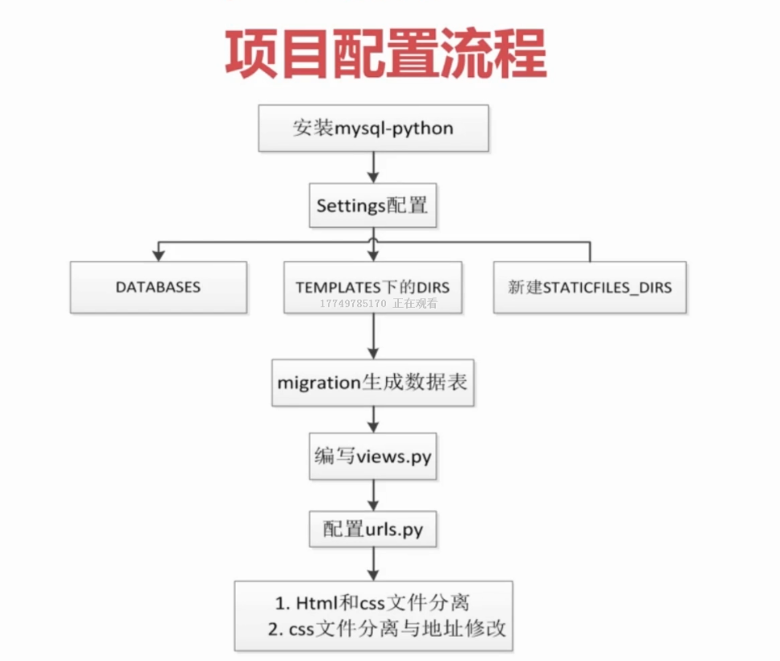


## 3.2 django快速搭建表单提交的页面

### 3.2.1 建立项目

首先新建一个app，叫做message，它放在apps文件夹下 (apps文件夹有`__init__.py`，表示它能作为包导入)。

然后，在view中写上form的view：

```\
def getform(request):
    return render(request, 'message.html')
```

然后，在URL中配置，某URL转到该view:

```
from apps.message.views import getform

urlpatterns = [
    path('form/', getform),
]
```


### 3.2.2 用户留言信息`数据表`的生成：

首先在message的models.py 中创建model：

```
class UserMessage(models.Model):
    name = models.CharField(max_length=20, verbose_name="用户名")
    email = models.EmailField(verbose_name="邮箱")
    address = models.CharField(max_length=100, verbose_name="联系地址")
    message = models.CharField(max_length=500, verbose_name="留言信息")

    class Meta:
        verbose_name = "用户留言信息"
```

然后注册进setting中：

```
INSTALLED_APPS = [
    'django.contrib.admin',
    'django.contrib.auth',
    'django.contrib.contenttypes',
    'django.contrib.sessions',
    'django.contrib.messages',
    'django.contrib.staticfiles',
    'apps.message',
]
```

然后，makemigrate， migrate操作，生成表。

###　3.2.3 网页查询: 传数据到后台

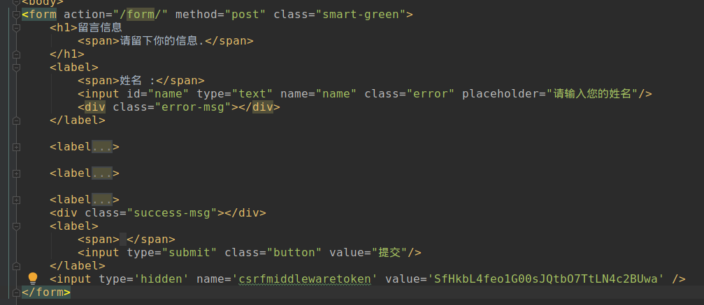


来看我们的表单，`form`，它的action是我们之前配置的URL，要以斜杠开头，表示根路径之下的form；

然后，它有input，能将值传递给后台。这样就能获得传递过来的值。

另外`</form>` 之前要加上``，这样才允许提交。

当我们提交之后，view中的request 对象就包含了我们刚才传进来的参数。传递进来的时候，是以`<input .. name = >` 这个name 传进来的。


###　3.2.4 后台对数据库的增删改查

```
# 在view 中进行操作：

from .models import UserMessage

# Create your views here.

def getform(request):
    # 数据的增加：
    user_message = UserMessage()
    user_message.message = "hi"
    user_message.name = "bobo"
    user_message.address = "上海"
    user_message.email = "158@11.com"
    user_message.save()


    # 数据的删除：
    all_message = UserMessage.objects.filter(city="北京")
    all_message.delete() # 删除所有查询到的QuerySet； 也可以一条一条删除。

    # 从网页获取用户的数据
    if request.method == 'POST':
        name = request.POST.get('name','') # 如果取不到，默认为空;这个key为input 中的name 属性的值。
        message = request.POST.get('message', '')
        email = request.POST.get('email', '')
        address = request.POST.get('address', '')
        # 这里我们就从表单中获得了用户的输入，通过上面的方法，就能保存到数据库中了。
        print(name, message, email, address)

    # 数据的查询
    all_messages = UserMessage.objects.all() # 获取全部的信息
    all_messages2 = UserMessage.objects.filter(name="bobby", address= "hi") # 查询
    for a_message in all_messages: # querySet 类型。可设置断点进行查询。
        pass

    return render(request, 'message.html')
```


### 3.2.5 URL的配置及如何将后台数据呈现到前端

#### 3.2.5.1 URL的配置技巧：使用name作为URL别名

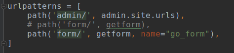

> URL 配置的时候，有个name参数，这样做的好处：比如在配置form时,就可以直接写URL的name,而不用写URL的实际地址.这在我们后面变更地址时非常有用,只需要更改urls.py 中的配置就行,不用改html中的信息.html中是URL的***别名***.

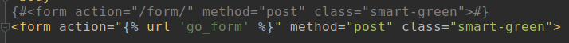


#### 3.2.5.2 后台返回数据给前端

> 首先在后端view中回传一个字典，包含数据：

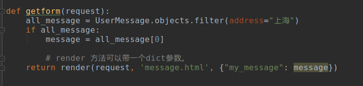

> 然后，利用模板，将回传的数据显示在网页中：


注意`testarea` 的值是写在两个符号之间的。

> 效果：

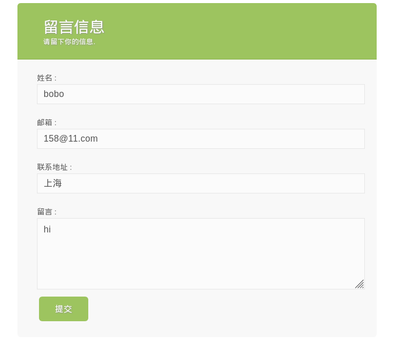


### 3.2.6 Template中if else 等用法：

Django 魔板有很多限制，不能在里面写Python逻辑。Django这样做的目的是防止我们在html中写入过多python逻辑。

如果想用if else, 就要利用Django 模板给我们提供的用法：

### if 的用法

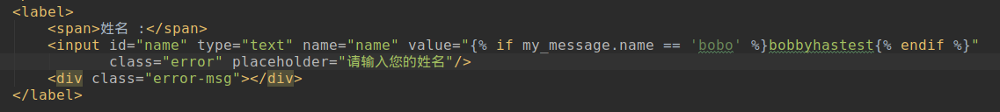

### if ... else ... 

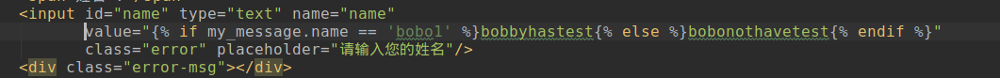

> 效果

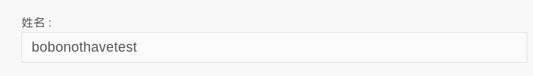

### ifequal的用法

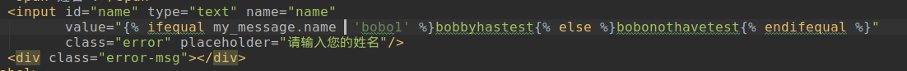


与if else 用法基本相同，只是`ifequal`传递俩值，`ifequal a b`; 而不是`if a==b`

### slice 的用法

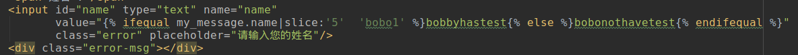

> 示例是对my_message.name 取前5个字符，用ifequal 判断是不是等于bobo1


更多函数的用法，参考Django document。


# 4. 备注

### arch linux中安装Mysql
[+] 完全参考 https://blog.csdn.net/u011054333/article/details/53203787


```
安装mysql：
sudo pacman -S mariadb mariadb-clients # arch 平台

sudo mysql_install_db --user=mysql --basedir=/usr --datadir=/var/lib/mysql # 初始化MariaDb的数据目录了

sudo systemctl start mysqld #启动MariaDb
mysqladmin -u root password '12345678' # 然后为root用户设置一个新密码
mysql -uroot -p 12345678 # 然后尝试登录MariaDb，如果登录成功，说明配置完成了，

sudo systemctl enable mysqld #MariaDb开机自动启动
```


