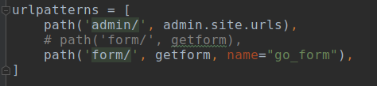

## 第一章：开发环境搭建

+ Arch Linux下安装： `pycharm-professional`，`mysql`，`dbeaver` (Mac或Windows可以使用`navicat`)

  ```
  sudo pacman -S pycharm-professional dbeaver
  ```

+ 安装pyenv进行python环境管理 (当用 `pycharm` 时可忽略这一步，因为`pycharm`可在项目文件夹自动创建虚拟环境)。

  ``` 
  # 根据pyenv 网站说明，进行安装pyenv 来管理python环境: 
  
  $ git clone https://github.com/pyenv/pyenv.git ~/.pyenv
  $ echo 'export PYENV_ROOT="$HOME/.pyenv"' >> ~/.zshrc
  $ echo 'export PATH="$PYENV_ROOT/bin:$PATH"'  >>~/.zshrc
  $ echo -e 'if command -v pyenv 1>/dev/null 2>&1; then\n  eval "$(pyenv init -)"\nfi' >> ~/.zshrc       
  $ exec "$SHELL"
  
  # 查看可用python的版本并安装：
  pyenv install -l
  pyenv install 3.7.2 # 如果速度太慢，可下载安装包，放到 `～/.pyenv/cache/` 中，再执行该命令。
  ```


## 第二章：Django基础介绍

目标：从数据库**取数据**并展示到网页

### 2.1 Django 目录结构与前期配置

#### 2.1.1 Django目录结构

> 新建一个Django项目，默认结构是：

```
❯ django-admin startproject Helloworld

❯ tree Helloworld 
Helloworld
├── Helloworld
│   ├── __init__.py
│   ├── settings.py
│   ├── urls.py
│   └── wsgi.py
└── manage.py

1 directory, 5 files

```

> 新建一些目录，可以优化项目的结构:

```
log: 存放log文件
media：存放用户上传的数据
apps: 存放我们新建的app，注意这里要在settings中设置成根搜索路径。
static: js, css, pic 等文件。
templates: 存放html 文件
```

> 新建了`templates`与`static`文件夹，还不能直接使用，需要进行配置

#### 2.1.2 `templates`与`static`文件夹设置

在`settings.py`中，进行下面配置

> `templates`文件夹设置

```
TEMPLATES = [
    {
        'BACKEND': 'django.template.backends.django.DjangoTemplates',
        
        'DIRS': [os.path.join(BASE_DIR, 'templates')], # 这里设置
        
        'APP_DIRS': True,
        'OPTIONS': {
            'context_processors': [
                'django.template.context_processors.debug',
                'django.template.context_processors.request',
                'django.contrib.auth.context_processors.auth',
                'django.contrib.messages.context_processors.messages',
            ],
        },
    },
]
```

> `static`文件夹设置

```
# 设置样式文件夹：表示当我们请求这个地址时，从指定路径去找static文件
STATIC_URL = '/static/'

# 添加static 文件夹到根搜索路径
STATICFILES_DIRS = [
    os.path.join(BASE_DIR, 'static')
]
```

#### 2.1.3 Django 连接MySQL数据库

> 安装插件

```
# python3 中 `pip install pymysql`

# 在项目文件夹下的 `_init_.py` 添加如下代码即可:

import pymysql
pymysql.install_as_MySQLdb()
```

> `settings.py`中配置数据库：

```
# 然后使用DBeaver新建一个数据库为 `test_django` (需要先建，然后再配置进Django中);

# 然后在 `settings.py` 中配置为：
DATABASES = {
    'default': {
        'ENGINE': 'django.db.backends.mysql',
        'NAME': 'test_django',
        'USER':"root",
        'PASSWORD':"my_password",
        'HOST': "127.0.0.1"
    }
}
```

> 在命令行生成Django数据表

```
python manage.py makemigrations
python manage.py migrate
```


总结一下我们上面所做的配置：

1. 安装并配置了`pymysql`插件，使得Django能够访问mysql;
2. 修改了`settings.py`，指定了`template`文件夹与`static`文件夹，以存放`html` 和 `css`等文件

上面这些配置都是一次性的，仅在项目最初使用。

{:height="50%" width="50%"}

### 2.2 django快速搭建表单提交的页面

#### 2.2.1 建立项目

首先新建一个app，叫做message，它放在apps文件夹下 (apps文件夹有`__init__.py`，表示它能作为包导入)。

然后，在view中写上`form`的view：

```\
def getform(request):
    return render(request, 'message.html')
```

然后，在`urls.py`中配置，当请求某url时，转到该view:

```
from apps.message.views import getform

urlpatterns = [
    path('form/', getform),
]
```

这样当我们访问`/form/`时，Django就会返回给我们`message.html`

#### 2.2.2 用户留言信息`数据表`的生成：

我们想要保存、提取用户留言信息，首先需要在message app的models.py 中创建model：

```
class UserMessage(models.Model):
    name = models.CharField(max_length=20, verbose_name="用户名")
    email = models.EmailField(verbose_name="邮箱")
    address = models.CharField(max_length=100, verbose_name="联系地址")
    message = models.CharField(max_length=500, verbose_name="留言信息")

    class Meta:
        verbose_name = "用户留言信息"
```

并且需要将app注册进setting中：

```
INSTALLED_APPS = [
    'django.contrib.admin',
    'django.contrib.auth',
    'django.contrib.contenttypes',
    'django.contrib.sessions',
    'django.contrib.messages',
    'django.contrib.staticfiles',
    'apps.message',
]
```

然后，makemigrate， migrate操作，生成用户留言信息表。

#### 2.2.3 网页查询: 传数据到后台


当我们点击提交，该`form`表单将把数据提交给`action`指定的`url`，这里``url`是`/form/` (后台将由`/form/`对应的view进行处理)。

每个`input`都有个`name`属性，点击提交之后，request对象将把这些值以键值对(name为键，value为值)的形式传递给函数，这些数据保存在request对象中。

另外由于Django的安全机制，`</form>` 之前要加上``，这样才允许提交。

#### 2.2.4 后台对数据库的增删改查

```
# 在view 中进行操作：

from .models import UserMessage

# Create your views here.

def getform(request):
    # 数据的增加：
    user_message = UserMessage()
    user_message.message = "hi"
    user_message.name = "bobo"
    user_message.address = "上海"
    user_message.email = "158@11.com"
    user_message.save() # 保存到数据库中

    # 数据的查询
    all_messages = UserMessage.objects.all() # 获取全部的信息
    all_messages2 = UserMessage.objects.filter(name="bobby", address= "hi") # 查询
    for a_message in all_messages: # querySet 类型。可进行迭代
        pass

    # 从网页获取用户的数据：request.POST.get()方法
    if request.method == 'POST':
        name = request.POST.get('name','') # 如果取不到，默认为空;这个key为 input 中的 name 属性。
        message = request.POST.get('message', '')
        email = request.POST.get('email', '')
        address = request.POST.get('address', '')
        # 这里我们就从表单中获得了用户的输入，通过上面的方法，就能保存到数据库中了。
        print(name, message, email, address)

    # 数据的删除：
    all_message = UserMessage.objects.filter(city="北京")
    all_message.delete() # 删除所有查询到的QuerySet； 也可以一条一条删除。

    return render(request, 'message.html')
```

#### 2.2.5 URL的配置及如何将后台数据呈现到前端

##### 2.2.5.1 URL的配置技巧：使用name作为URL别名



> URL 配置的时候，可以设置 `name` 参数。可以在 `html` 中作为URL的**别名**来使用.
>
> 比如在配置`form`的`action`时，就可以直接写URL的`name`,而不用写URL的实际地址。
>
> 优点：这在我们后面变更地址时非常有用，只需要更改`urls.py` 中的配置就行,不用改html中的信息。


##### 2.2.5.2 后台返回数据给前端

> 后端`view`中可以回传一个字典，从而传递数据到前端：


> 然后，利用Django模板特性，将回传的数据显示在网页中：


注意`testarea` 的值是写在两个符号之间的。

> 效果：


#### 2.2.6 Template 中 if else 等用法：

Django 模板有很多限制，不能在里面写Python逻辑。Django这样做的目的是防止我们在html中写入过多python逻辑。

如果想用`if else`, 就要利用 Django 模板给我们提供的用法：

#### if 的用法


#### if ... else ...


> 效果


#### ifequal的用法


与if else 用法基本相同，只是`ifequal`传递俩值，`ifequal a b`; 而不是`if a==b`

#### slice 的用法


> 示例是对my_message.name 取前5个字符，用ifequal 判断是不是等于bobo1

Django提供和很多函数，以避免插入太多Python逻辑，更多函数的用法，参考 Django document。

## 备注：arch linux中安装Mysql

* 完全参考 https://blog.csdn.net/u011054333/article/details/53203787


```
安装mysql：
sudo pacman -S mariadb mariadb-clients # arch 平台

sudo mysql_install_db --user=mysql --basedir=/usr --datadir=/var/lib/mysql # 初始化MariaDb的数据目录了

sudo systemctl start mysqld #启动MariaDb
mysqladmin -u root password '12345678' # 然后为root用户设置一个新密码
mysql -uroot -p 12345678 # 然后尝试登录MariaDb，如果登录成功，说明配置完成了，

sudo systemctl enable mysqld #MariaDb开机自动启动
```


