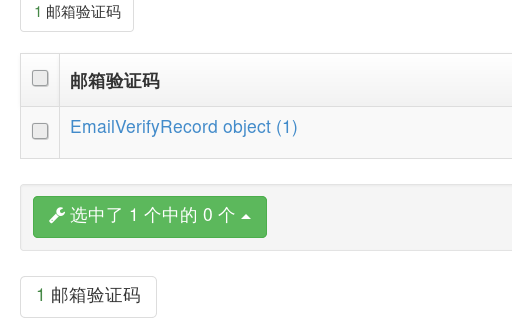
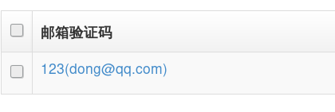
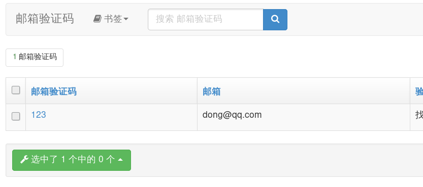
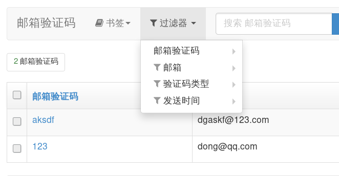
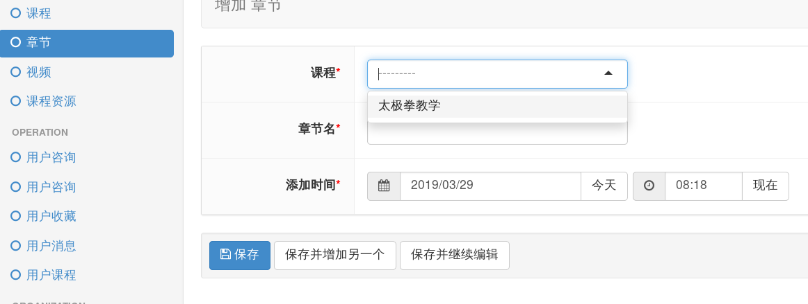
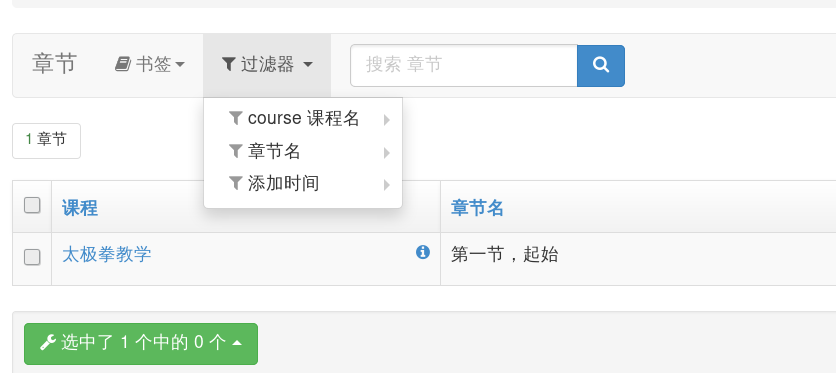
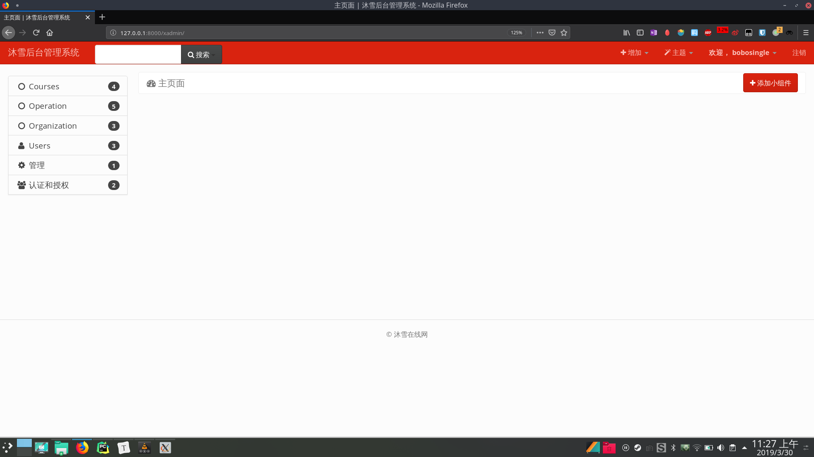

# 第五章_后台管理系统

Django 后台管理系统的特点：

- 权限管理

- 少前端样式

- 快速开发

> Django 自带`admin`这个app，可通过`settings`的`installed_app`来查看。`URL`中默认也配置了`admin`的地址。


## 创建超级用户

```
$ createsuperuser

用户名/密码/管理员邮箱 (我创建的超级用户)

Django 默认是通过 `用户名` 和 `密码` 来登录的。后面会学习配置邮箱登录。
```

## 修改`setting`, 将后台配置为中文

```
# LANGUAGE_CODE = 'en-us'
LANGUAGE_CODE = 'zh-hans'

# TIME_ZONE = 'UTC'
TIME_ZONE = 'Asia/Shanghai'

USE_I18N = True

USE_L10N = True

USE_TZ = False # 需要改为false，否则Djang数据库在存取时，会把时间存为UTC时间。
```


## 默认的后台管理系统

Django默认为我们注册了个组，这个组对应后台的数据表是`auth_group`; 默认会把`user`注册进来，因为我们重载了`user_profile`，它就取消注册了。
现在我们注册进来：

进入`users` 这个app，之下有个`admin.py `文件，它就是用来注册后台管理系统的。

```
from django.contrib import admin

# Register your models here.

from .models import UserProfile

# 为model写一个管理器：
class UserProfileAdmin(admin.ModelAdmin):
    pass

# 把admin与model关联注册
admin.site.register(UserProfile, UserProfileAdmin)
```

# 开始xadmin！

`xadmin`是基于Django admin的后台管理系统，比Django 自带的admin更强大。

有两种安装方式

1. 通过pip安装（pip中的版本很老了。我的Djanog版本是2.1.7, pip 安装会将Django 降级到1.11；这里pip安装过xadmin之后，再将Django升级回来。）

github 提供了Django2 版本的xadmin，这里按照命令下载安装：

```
pip install git+git://github.com/sshwsfc/xadmin.git@django2
```

2. 根据源码来安装的。

到xadmin的github的release查看，发现有xadmin@2.0.1 这样的包。下载它。

这里我先不这样做，等后面需要的时候，我再这样做。作者这样做是为了体验新功能。我没这个需求。

## 初次配置使用 xadmin

> 使用上面命令安装之后，会安装很多依赖。
>
> 其中有 `crispy_forms` ，需要把它和 xadmin 都注册到 setting 中：

```
...
INSTALLED_APPS = [
 ...
    'crispy_forms',
    'xadmin',
]
```

> 然后配置URL：

```
import xadmin
urlpatterns = [
    path('xadmin/', xadmin.site.urls),
]
```

> 注释掉前面注册进admin.py 的user表。
>
> 重启访问xadmin，提示`mxonline.xadmin_usersettings`，是因为xadmin有些默认的表，需要同步过来，通过migrate等。


## 将model注册进xadmin及如何使用

> xadmin 的注册方法与admin类似。
>
> 在usersapp下新建`adminx.py`:

```
# adminx.py

import xadmin

from .models import EmailVerifyRecord

class EmailVerifyRecordAdmin(object):
    pass

xadmin.site.register(EmailVerifyRecord, EmailVerifyRecordAdmin)
```

> 这样就好了！

我们添加一条邮箱验证码记录，却发现：



这里应该是`邮箱`！我们需要在model中重载`__str__` 方法 (python2 中需要重载`__unicode__方法`，python3 是`__str__`方法)：

```
def email():
...
  def __str__(self):
      return '{0}({1})'.format(self.code, self.email)
```



### 自定义显示某列


`xadmin`也有自定义显示某些列的功能，但是当刷新页面时，又会恢复默认，这里需要自定义显示某列。

```
修改adminx.py 文件，里面需要定义一个变量。顺序就是我们数组中的顺序。
class EmailVerifyRecordAdmin(object):
    list_display = ['code', 'email', 'send_type', 'send_time']
```

刷新后可看到效果：


### 后台搜索功能的设置：

需要增加搜索字段：

```
class EmailVerifyRecordAdmin(object):
    list_display = ['code', 'email', 'send_type', 'send_time']
    search_fields = ['code', 'email', 'send_type']
```

### 筛选的设置



需要设置：

```
class EmailVerifyRecordAdmin(object):
    list_display = ['code', 'email', 'send_type', 'send_time']
    search_fields = ['code', 'email', 'send_type']
    list_filter = ['code', 'email', 'send_type', 'send_time']

xadmin.site.register(EmailVerify, EmailVerifyAdmin)#注册进来
```


> 按上面这种方法，将所有的model注册进xadmin

我们新建一个课程：


> 然后，新建章节的时候，就会显示课程名，因为我们使用了外键。实际上显示的是`course object`, 需要在课程里重载`__str__`方法才行。见model的设计代码。



> 添加一个章节之后的信息：


我们看到过滤这里并么有显示我们制定的`course`,这是什么原因呢？因为我们没有指定这个搜索这个外键的哪个字段。

修改成：

```
class LessonAdmin(object):
   list_display = ['course', 'name', 'add_time']
   search_fields = ['course', 'name']
   list_filter = ['course__name', 'name', 'add_time']
xadmin.site.register(Lesson, LessonAdmin)
```

同时，如果是个外键，会有个`i`的标识，就是这个外键的详情。




## 全局配置xadmin

### xadmin主题功能

> 把全站的配置放在user\adminx.py中

```
# users/adminx.py 中
from xadmin import views

class BaseSetting(object):
    enable_themes = True
    use_bootswatch = True # 以上设置主题。

xadmin.site.register(views.BaseAdminView, BaseSetting) # 注册的时候，需要把BaseSetting与view关联起来，这个view 是放在xadmin中的views。import... 
```

### 修改左上角文字及底下公司名称

```
# users/adminx.py 中
class GlobalSettings(object):
    site_title = "沐雪后台管理系统"
    site_footer = "沐雪在线网"

xadmin.site.register(views.CommAdminView, GlobalSettings)
```

### 收起view到model中

```
# 只需要修改一个参数：
class GlobalSettings(object):
    site_title = "沐雪后台管理系统"
    site_footer = "沐雪在线网"

    menu_style = "accordion"
```




### 自定义修改model的名称

```
# app在生成之后，会有个apps.py 这个文件，这个文件就是用来配置app显示名称的。

# 第一步：添加verbose_name
# users/apps.py:
class UsersConfig(AppConfig):
    name = 'users'

    verbose_name = "用户" # 新添加这一行

# 第二步：修改users/__init__.py， 添加变量default_app_config, 因为Djanog新建app时，没有把Config加上引用。我们自己手动加上。

default_app_config = "users.apps.UsersConfig" # 添加这一行

# 第三步：对其他的model这样操作。
```
