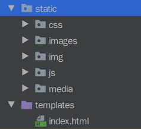
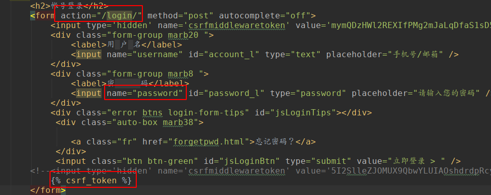
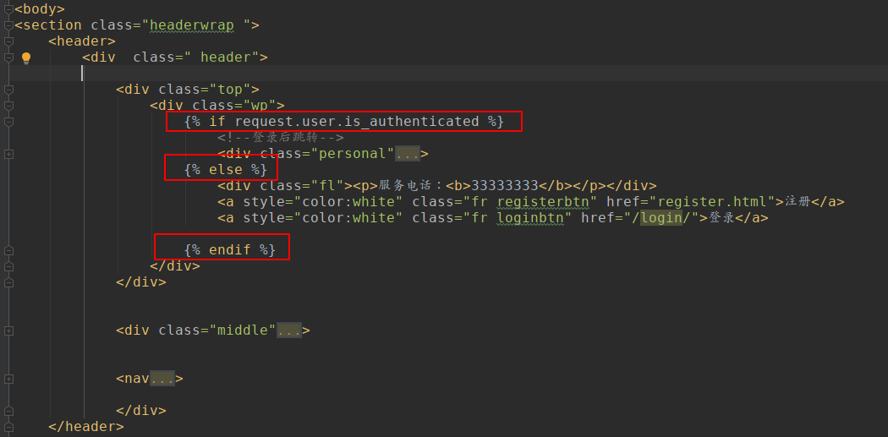
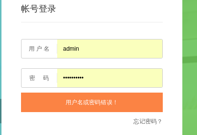

## 基础配置以正确显示页面

```
# 1. 新建static 文件夹，把css，image等复制过来。
# 2. 将index.html 复制过来到templates中
# 3. 修改url，使能够跳转过来：

> **TemplateView** 直接返回一个html

# urls.py 文件：
from django.views.generic import TemplateView # 专门处理静态文件

urlpatterns = [
    path('', TemplateView.as_view(template_name='index.html'), name="index"),  # 讲template转为view
]


# 4.1 修改 settings.py ，配置 static 文件夹：
STATIC_URL = '/static/'
STATICFILES_DIRS = (
    os.path.join(BASE_DIR, 'static'), # 表示当请求/static/路径时，会到这里寻找文件。
)

# 4.2 修改template搜索文件夹，这样才能找到该文件夹下的html
'DIRS': [os.path.join(BASE_DIR, 'templates')],

# 4.3 设置/media/banner/**.png这样的文件：
/media 存放了用户上传的文件。
# 在settings.py中配置：
MEDIA_ROOT = os.path.join(BASE_DIR,"media") #注意:这里配置os的时候,不像配置static的时候要[],这里不需要[]
MEDIA_URL = "/media/"
# 在urls.py中配置：
from django.conf import settings
from django.conf.urls.static import static

urlpatterns = [
    path('xadmin/', xadmin.site.urls),
] + static(settings.MEDIA_URL, document_root=settings.MEDIA_ROOT)

 
# 5.修改 index.html , 将相对路径修改成
</a>

# 这样，就可以显示了。
很奇怪，火狐中用隐私窗口打开页面是正常，正常打开就是乱，chrome 没问题。
```



## 登录页面配置

```
# 1. 登录的 login.html 文件也拷贝进来templates。并修改css等静态文件的路径。

# 2. 修改url, 跳转到登录界面
    path('login/', TemplateView.as_view(template_name='login.html', name='login')),
    
# 3. 然后我们要修改 index.html，能够跳转到login.html 来
<a style="color:white" class="fr loginbtn" href="/login/">登录</a>
```


## 用户登录的后台逻辑

```
# 我们想要在用户是 get 方法的时候返回登录页面，在是 post 方法的时候，验证输入，我们这样配置：
# users/views.py 中：

def login(request):
    if request.method == 'POST':
        pass
    elif request.method == 'GET':
        return render(request, 'login.html', {})

# 我们不想用两个url实现上面的功能，因此，用一个url指向这个view：
# 配置urls.py ：

from users.views import login
... 
    # path('login/', TemplateView.as_view(template_name='login.html'), name='login'),
    path('login/', login, name='login'),
```


>  login.html 中form表单的配置：
>
> 需要注意的点：action：提交给哪个url，name属性是传给后台键值对的形式的数据；



### 从前端取值，判断能否登录

```
# 继续完善后台逻辑
from django.shortcuts import render
from django.contrib.auth import authenticate, login # 用户名密码验证
from django.contrib.auth.backends import ModelBackend
from django.db.models import Q

from .models import UserProfile

def user_login(request): # 注意这里的名称，因为下面需要调用auth.login这个函数，所以这里起名叫login就不合适了，会冲突。因而改成user_login.
    if request.method == 'POST':
        user_name = request.POST.get("username", "") # 默认为空
        pass_word = request.POST.get("password", "")  # 默认为空

        # 得到用户名密码之后，需要进行验证。
        user = authenticate(username=user_name, password=pass_word) # 验证成功会返回user对象，失败会返回None

        if user is not None: #表明user验证成功，
            login(request, user) # 调用login之后，实际是向request写入了一些东西。
            return render(request, "index.html", {}) # login成功之后，跳转到首页。在index中做判断。
        else:
            return render(request, "login.html", {})

    elif request.method == 'GET':
        return render(request, 'login.html', {})
```

```
#这时，后端判断验证成功，前端则需要显示对应的代码：
＃ 利用request.user.is_authenticated 方法，判断，显示登录框，还是显示用户的信息。
```



### 我们还想利用邮箱登录

相当于利用用户名或者email去查询是否存在user这样的obj，如果存在就对这个object进行check_password

```
# 1. users/views.py 添加一个model，重载authenticate方法，具体需要导入的，见上面的代码块。

class CustomBackend(ModelBackend):
    def authenticate(self, request, username=None, password=None, **kwargs):
        try:
            user = UserProfile.objects.get(Q(username=username) | Q(email=username)) #密码是密文，没法查。这查到的是什么东西，username与邮箱查到的是一样的吗？试了一下，能够登录的输入，用户名和邮箱，两个查到的都是bobosingle；不能登录的输入在query的时候出错，就会到except中。
            if user.check_password(password):# 因为user继承的是abstractuser，里面有个方法，check_password
                return user
        except Exception as e:
            return None
```

```
# 另外，还需要在settings.py 中重载变量，这样Djanog就知道用什么model进行用户名验证了。
AUTHENTICATION_BACKENDS = (
    'users.views.CustomBackend',
)
```

### 登录失败的提示

```
# 另外，当我们登录失败，带回来点信息，用于错误提示：
# 前端需要这么写（msg没东西的时候好像啥也不显示，有东西才显示）：
<div class="error btns login-form-tips" id="jsLoginTips">{{ msg }}</div>

#后端：
if user is not None:
	login(request, user) # 调用login之后，实际是向request写入了一些东西。
	return render(request, "index.html", {}) # login成功之后，跳转到首页。在index中做判断。
else:
	return render(request, "login.html", {"msg":"用户名或密码错误！"})
```




### 重构登录逻辑：基于函数改为基于类

之前的配置方法是基于函数来做的，本节中采用基于类的登录。Django**推荐使用基于类的验证方式**。

```
from django.shortcuts import render
from django.contrib.auth import authenticate, login # 用户名密码验证
from django.contrib.auth.backends import ModelBackend
from django.db.models import Q
from django.views.generic.base import View # 继承这个view，就可以实现基于类的登录。

from .models import UserProfile


# Create your views here.

class LoginView(View):
    def get(self, request): # 重写方法,当是get就会自动调用get函数，就不需要自己判断是get还是post了。
        return render(request, 'login.html', {})
    def post(self, request):
        user_name = request.POST.get("username", "")  # 默认为空
        pass_word = request.POST.get("password", "")  # 默认为空

        # 得到用户名密码之后，需要进行验证。
        user = authenticate(username=user_name, password=pass_word) # 验证成功会返回user对象，失败会返回None

        if user is not None:
            login(request, user) # 调用login之后，实际是向request写入了一些东西。
            return render(request, "index.html", {}) # login成功之后，跳转到首页。在index中做判断。
        else:
            return render(request, "login.html", {"msg":"用户名或密码错误！"})


class CustomBackend(ModelBackend):
    def authenticate(self, request, username=None, password=None, **kwargs):
        try:
            user = UserProfile.objects.get(Q(username=username) | Q(email=username)) #密码是密文，没法查
            if user.check_password(password): # 因为user继承的是abstractuser，里面有个方法，check_password
                return user
        except Exception as e:
            return None

# 改写成上面基于类的方式。
# def user_login(request):
#     if request.method == 'POST':
#         user_name = request.POST.get("username", "") # 默认为空
#         pass_word = request.POST.get("password", "")  # 默认为空
#
#         # 得到用户名密码之后，需要进行验证。
#         user = authenticate(username=user_name, password=pass_word) # 验证成功会返回user对象，失败会返回None
#
#         if user is not None:
#             login(request, user) # 调用login之后，实际是向request写入了一些东西。
#             return render(request, "index.html", {}) # login成功之后，跳转到首页。在index中做判断。
#         else:
#             return render(request, "login.html", {"msg":"用户名或密码错误！"})
#
#
#     elif request.method == 'GET':
#         return render(request, 'login.html', {})

```

```
同时，修改url：
from users.views import LoginView

urlpatterns = [
    path('admin/', admin.site.urls),
    path('xadmin/', xadmin.site.urls),
    path('', TemplateView.as_view(template_name='index.html'), name="index"),  # 讲template转为view
    # path('login/', TemplateView.as_view(template_name='login.html'), name='login'),
    path('login/', LoginView.as_view(), name='login'),
]
```


#### Django重要组件form

把用户提交的表单做预处理。利用form验证参数是否正确，自己写需要大量减少判断逻辑代码。长度、是否为空等判断。可以用form自动处理。

首先在Users app中创建一个forms.py文件，填入：
```
from django import forms

class LoginForm(forms.Form):
    username = forms.CharField(required=True)
    password = forms.CharField(required=True, min_length=3)
```

然后在views.py中调用这个方法进行校验：

```
from .forms import LoginForm

```
class LoginView(request):
    def get():
        pass
    def get():
    	login_form = LoginForm(request.POST)
	if login_form.is_valid():
	    pass
	    
```
> 有些需要注意的点：
> 1.forms.CharField()有很多参数可选，比如最大长度、最短长度、不为空等等。
> 2. LoginForm中的username和password需要和HTML中的字段名字对应上，如果HTML中为user_name，则LoginForm也必须作相应修改

最终这个LoginView为：
```
class LoginView(View):
    def get(self, request): # 重写方法,当是get就会自动调用get函数，就不需要自己判断是get还是post了。
        return render(request, 'login.html', {})
    def post(self, request):

        login_form = LoginForm(request.POST)
        if login_form.is_valid():
            user_name = request.POST.get("username", "")  # 默认为空
            pass_word = request.POST.get("password", "")  # 默认为空
    
            # 得到用户名密码之后，需要进行验证。
            user = authenticate(username=user_name, password=pass_word) # 验证成功会返回user对象，失败会返回None
    
            if user is not None:
                login(request, user) # 调用login之后，实际是向request写入了一些东西。
                return render(request, "index.html", {}) # login成功之后，跳转到首页。在index中做判断。
        else:
            return render(request, "login.html", {"msg":"用户名或密码错误！"})

```

