# 数据库设计

编写业务代码之前,需要首先对数据库进行设计.

## 需求分析:

+ 命名: 沐雪在线网

+ 网站logo

+ 首页设计:全局头,然后全局消息, 用户的个人中心(如果用户没登录,就是注册和登录; 登录了就是个人中心);
+ 搜索框; 可以对公开课, 课程讲师, 课程机构进行搜索;
+ 下面是轮播图

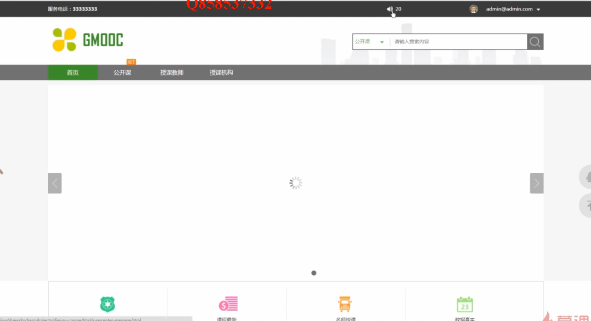


+ 再下面就是公开课, 

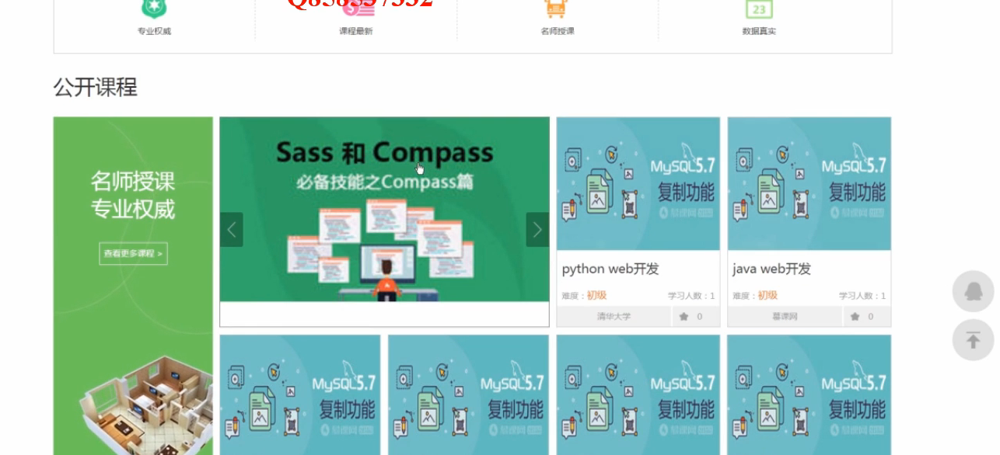


+ 在下面就是课程机构和页脚.


点击导航栏的公开课:

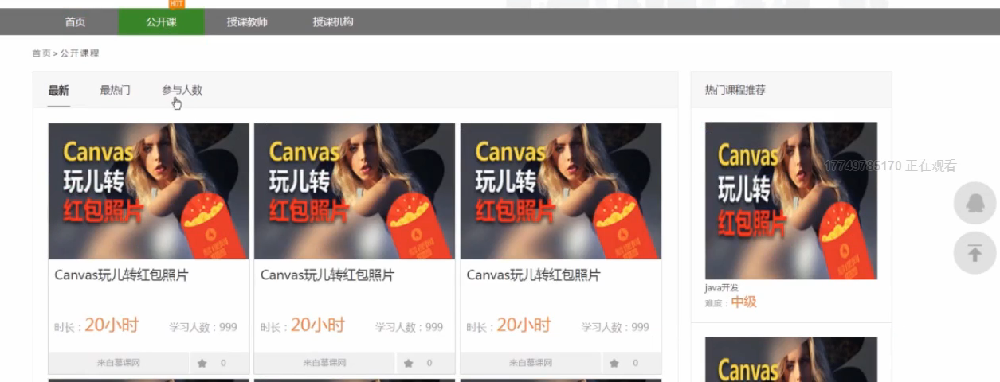

会显示公开课的内容, 热门,参与人数的信息; 右边是热门课程的推荐.

最下面有分页功能.


点击公开课,是课程详情页: 下面的课程详情是我们在后台编辑富文本来完成的.右边是课程机构的介绍,可以对课程进行收藏几进行学习. 

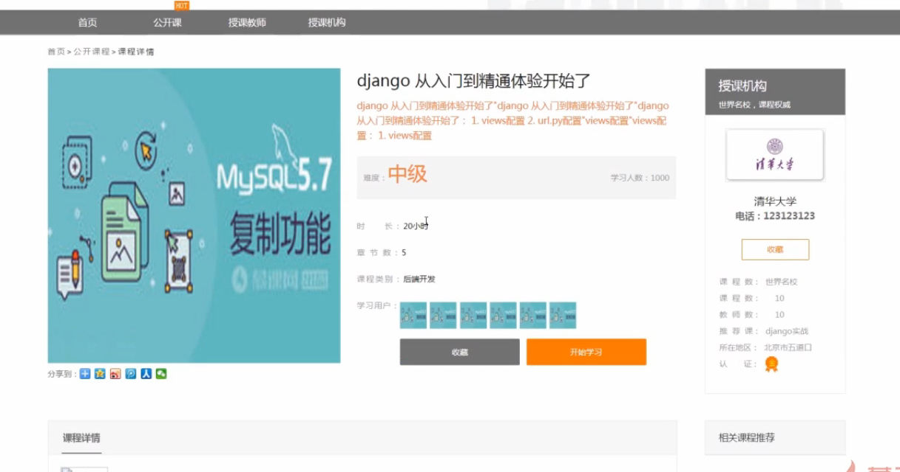

点击开始学习之后:

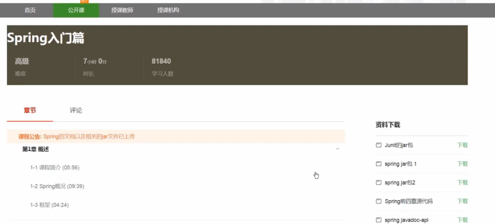


可以看到章节信息,点击各个章节信息,可以跳转到每个章节的播放页面,右边是课程资料, 最下面是评论框,可以对课程进行评论. 


然后是授课讲师, 讲师过多,下面也能进行分页.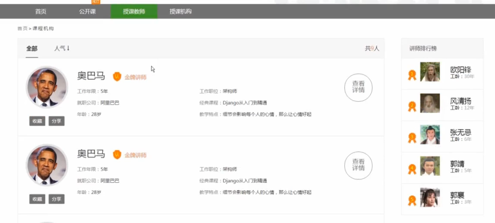


点击授课讲师,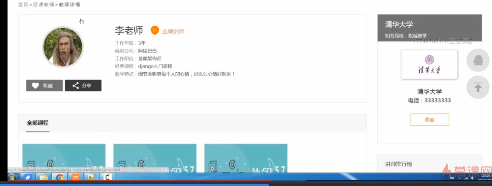

能显示讲师信息,及他的课程信息.

最后,点击导航栏的授课结构:

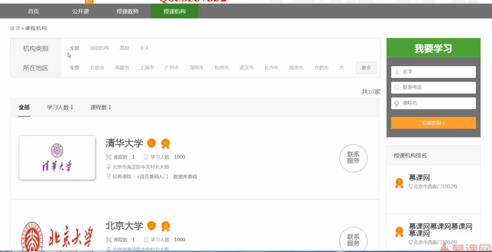


可以对授课机构进行类别筛选,所在地区筛选,对学习人数, 课程数排序; 最右边是我要学习的快速通道, 及授课机构的排名.


点击授课机构,每个授课机构都有个主页:可以进行收藏.查看讲师,介绍等信息.

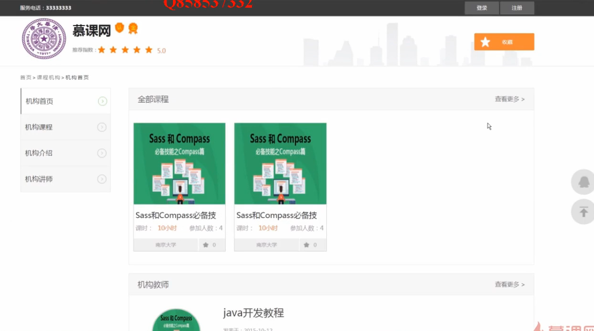


最后是个人中心:可以修改头像.密码,个人信息; 在我的课程中显示我的课程, 我的收藏: 包括机构,讲师,课程的收藏;

我的消息:当用户完成注册, 会发送全局消息.

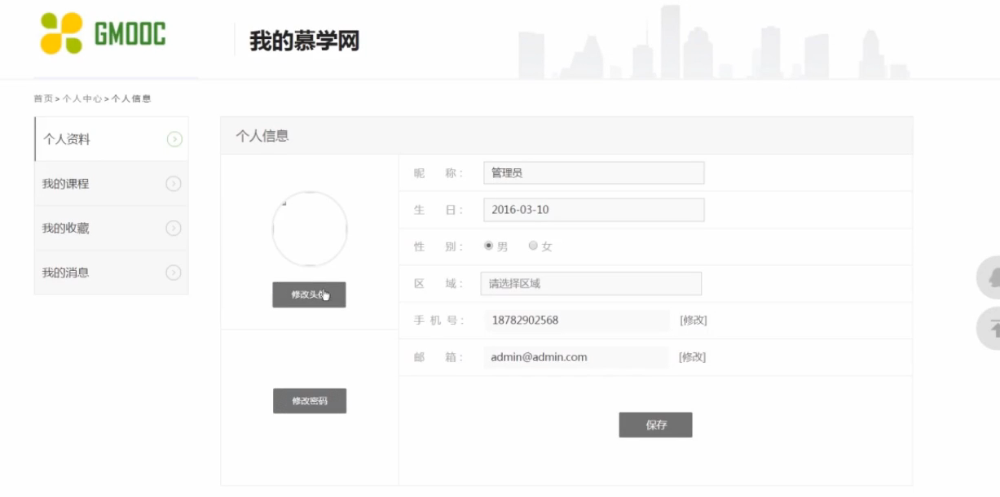


## Django app的设计

基于以上的需求分析, 需要设计下面的app:

Django的开发是基于app进行的

1. 用户模块
2. 公开课模块
3. 授课教师模块/授课机构模块 放在一起.

为什么会多出operation ? 后面再讲.

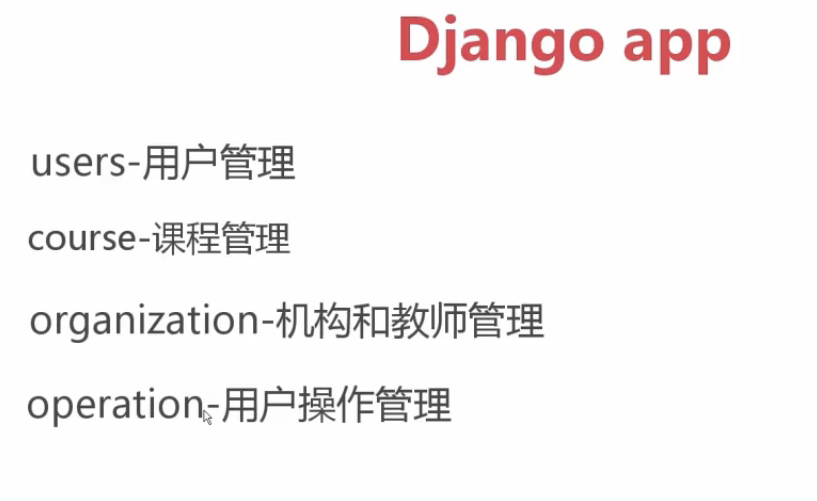


## 各个app models的设计

> 新建mxonline 这个Django项目，并安装mysql 驱动：

```
pip install pymysql
pip install Pillow # image 字段依赖
#然后，在ｍxonline 的__init__.py中添加
import pymysql
pymysql.install_as_MySQLdb()
```

> settings.py 的配置

```
# mysql 配置：
DATABASES = {
    'default': {
        'ENGINE': 'django.db.backends.mysql',
        'NAME': 'mxonline',
        'USER': 'root',
        'PASSWORD': 'jingyue949',
        'HOST': '127.0.0.1',
        # 'NAME': os.path.join(BASE_DIR, 'db.sqlite3'),
    }
}
```


### 1. Djanog User 数据表设计


```
$ startapp users
# 然后编写model，在任何web中，user表都是第一个需要被设计的。
# 首先看一下默认auth_user 表的默认字段：
```


```
# models.py: 

# 我们希望继承原有user字段，并进行拓展：
from django.contrib.auth.models import AbstractUser


class UserProfile(AbstractUser):
    nick_name = models.CharField(max_length=50, verbose_name="昵称", default="")
    birday = models.DateField(verbose_name='生日', null=True, blank=True)
    gender = models.CharField(max_length=5, choices=(('male', '男'), ('female', '女')), default='female', verbose_name="性别")
    address = models.CharField(max_length=100, default='', verbose_name="地址")
    mobile = models.CharField(max_length=11, null=True, blank=True, verbose_name="电话号码")
    image = models.ImageField(upload_to='image/%Y/%m', default='image/default.png', max_length=100, verbose_name="头像")

    class Meta:
        verbose_name = '用户信息'
        verbose_name_plural = verbose_name

    def __unicode__(self):
        return self.username


# 需要在setting 中进行注册：
INSTALLED_APPS = [
    'django.contrib.admin',
    'django.contrib.auth',
    'django.contrib.contenttypes',
    'django.contrib.sessions',
    'django.contrib.messages',
    'django.contrib.staticfiles',
    'users', # 注册进来。
]

AUTH_USER_MODEL = 'users.UserProfile' # 注意这一行也要加上。
```


> migrate 出错，需要删除所有表，重新生成即可。

### Django 循环引用的问题：


> 循环引用会出错。因此，需要利用分层设计，来避免这个问题。这个分层，我们抽象出来作为用户操作。


### 继续完善User profile：

```
邮箱验证码，首页轮播图，也放到user中来。

。。
```


### 2. course 的设计

```
course 课程基本信息
lesson 章节信息
video 视频
courseResource 课程资源
```


```
Model 的编写
```


## 数据表的生成与修改

